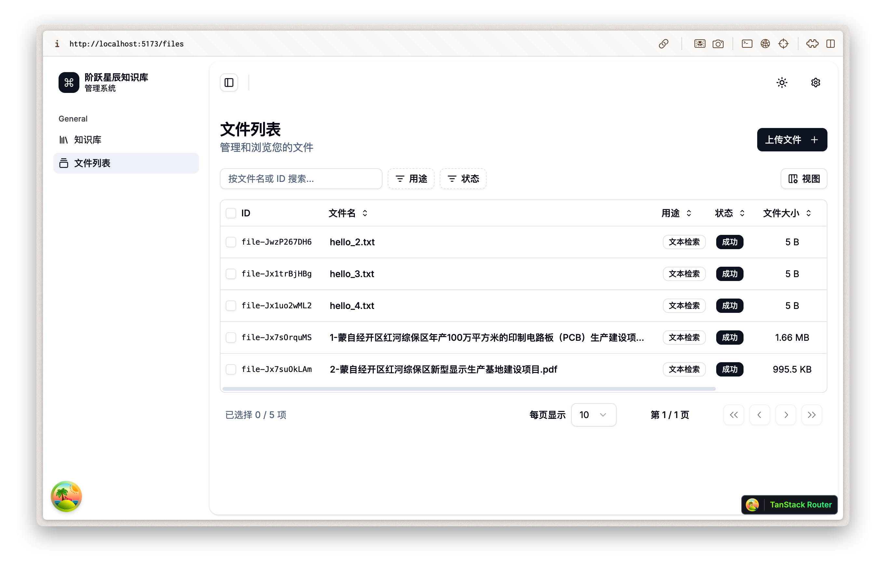

# 阶跃星辰知识库管理系统

[](https://github.com/tangledup-ai/stepfun-vector-stores-admin/actions/workflows/test.yml)

This project is built on [Shadcn Admin Dashboard](https://github.com/satnaing/shadcn-admin)



## Run Locally

Copy `.env.example` to `.env` for usage, and configure your secrets.

```bash
cp .env.example .env
```

Install dependencies & Build

```bash
pnpm install
```

```bash
pnpm build
```

Start the server

```bash
pnpm preview
```

## Credits

- [@satnaing](https://github.com/satnaing)

## License

Licensed under the [MIT License](https://choosealicense.com/licenses/mit/)
